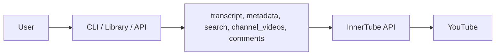

# InnerTube – YouTube Data

Python modules to fetch YouTube transcripts, metadata, search, channel videos, and comments via the InnerTube API. No official API key or quota limits. Config via `.env`.




## Install

```bash
pip install -r requirements.txt
```

Copy `.env.example` to `.env` and adjust if needed (defaults work out of the box).

## Usage

### As a Library

```python
from src.get_transcript import get_transcript
from src.get_metadata import get_metadata
from src.search import search
from src.get_channel_videos import get_channel_videos
from src.get_comments import get_comments

# Transcript (returns list of {text, start_ms})
segments = get_transcript("https://www.youtube.com/watch?v=dQw4w9WgXcQ")
for s in segments:
    print(s["text"])

# Metadata (returns dict)
meta = get_metadata("dQw4w9WgXcQ")
print(meta["titulo"], meta["views"], meta["thumbnail_url"])

# Search (returns {items, continuation})
result = search("arctic monkeys", type="video")
for item in result["items"]:
    print(f"[{item['type']}] {item['id']} - {item['title']}")

# Channel videos (returns {items, continuation})
result = get_channel_videos("UCXuqSBlHAE6Xw-yeJA0Tunw")
for item in result["items"]:
    print(f"[{item['video_id']}] {item['title']}")

# Comments (returns {items, continuation})
result = get_comments("dQw4w9WgXcQ", sort="top")
for item in result["items"]:
    print(f"[{item['autor']}] {item['texto']}")
```

### Command Line

```bash
python -m src.get_transcript dQw4w9WgXcQ
python -m src.get_metadata dQw4w9WgXcQ
python -m src.search "arctic monkeys" --type video
python -m src.get_channel_videos UCXuqSBlHAE6Xw-yeJA0Tunw
python -m src.get_comments dQw4w9WgXcQ --sort top
```

## Test 

```bash
python -m src.test_all
```

## API

```bash
python -m uvicorn src.api:app --reload
```

Server at `http://127.0.0.1:8000`. Interactive docs at `/docs`.

**Postman:** Import `InnerTchube.postman_collection.json` in Postman to test all endpoints (transcript, metadata, search, channel-videos, comments) with ready-made examples. The collection includes requests with and without pagination (continuation).

curl example:

```bash
curl "http://127.0.0.1:8000/transcript?url_or_id=dQw4w9WgXcQ"
```

## Config

Parameters (API keys, versions, timeout) in `.env`. Copy `.env.example` to `.env`.

Functions accept full URLs or video ID (11 chars): `https://www.youtube.com/watch?v=VIDEO_ID`, `https://youtu.be/VIDEO_ID`, `dQw4w9WgXcQ`.

## Structure

```
innertube/
├── src/
│   ├── get_transcript.py
│   ├── get_metadata.py
│   ├── get_transcript_lib.py
│   ├── search.py
│   ├── get_channel_videos.py
│   ├── get_comments.py
│   ├── config.py
│   ├── test_all.py
│   └── api.py
├── InnerTchube.postman_collection.json
├── .env.example
├── requirements.txt
└── README.md
```

## Limitations

- **Transcript:** Only videos with captions (manual or auto-generated).
- **Metadata:** Structure may change if YouTube updates InnerTube.
- **Comments:** On some videos `autor` and `texto` may be empty; pagination via `continuation` works.

## License

Use at your own risk. This project is not affiliated with YouTube or Google.