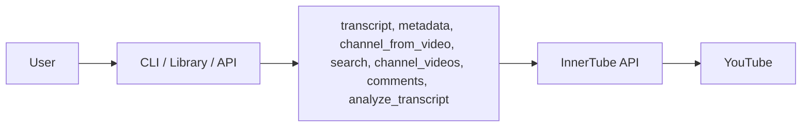

# InnerTube – YouTube Data

Python modules to fetch YouTube transcripts, metadata, search, channel videos, channel-from-video, and comments via the InnerTube API. No official API key or quota limits. Config via `.env`.




## Install

```bash
pip install -r requirements.txt
```

Copy `.env.example` to `.env` and adjust if needed (defaults work out of the box). Note: `httpx` is pinned for innertube compatibility.

## Docker

Imagem leve com Python 3.13-slim. Build carrega apenas o necessário.

```bash
# Build
docker build -t innertube:latest .

# Run (crie .env a partir de .env.example se precisar de config)
docker run -p 8000:8000 -v $(pwd)/output:/app/output -v $(pwd)/monitored_channels.json:/app/monitored_channels.json innertube:latest
```

Ou com Docker Compose:

```bash
cp .env.example .env   # obrigatório: WEB_API_KEY, ANDROID_API_KEY
docker compose up -d
```

API em `http://localhost:8000`, docs em `/docs`. Qdrant em `http://localhost:6333`. Volumes: `output/`, `monitored_channels.json`, `qdrant_storage/`. A API usa `env_file: .env` e conecta ao Qdrant via `QDRANT_URL=http://qdrant:6333`.

## Usage

### As a Library

```python
from src.get_transcript import get_transcript
from src.get_metadata import get_metadata
from src.get_channel_from_video import get_channel_from_video
from src.search import search
from src.get_channel_videos import get_channel_videos
from src.get_comments import get_comments
from src.analyze_transcript import analyze_transcript

# Transcript (returns list of {text, start_ms})
segments = get_transcript("https://www.youtube.com/watch?v=dQw4w9WgXcQ")
for s in segments:
    print(s["text"])

# Metadata (returns dict)
meta = get_metadata("dQw4w9WgXcQ")
print(meta["titulo"], meta["views"], meta["thumbnail_url"])

# Channel from video (returns {canal_id, nome, url_canal})
channel = get_channel_from_video("dQw4w9WgXcQ")
print(channel["canal_id"], channel["nome"])

# Search (returns {items, continuation})
result = search("arctic monkeys", type="video")
for item in result["items"]:
    print(f"[{item['type']}] {item['id']} - {item['title']}")

# Channel videos (returns {items, continuation})
result = get_channel_videos("UCXuqSBlHAE6Xw-yeJA0Tunw")
for item in result["items"]:
    print(f"[{item['video_id']}] {item['title']}")

# Comments (returns {items, continuation})
result = get_comments("dQw4w9WgXcQ", sort="top")
for item in result["items"]:
    print(f"[{item['autor']}] {item['texto']}")

# Analyze transcript with Gemini (returns {text, usage?})
result = analyze_transcript("dQw4w9WgXcQ", "Summarize this video")
print(result["text"])

# Embeddings (POST /embeddings with video_id: load/process, embed transcript, save to Qdrant)
# Use the API: POST /embeddings with body {"video_id": "dQw4w9WgXcQ"}
```

### Command Line

```bash
python -m src.get_transcript dQw4w9WgXcQ
python -m src.get_metadata dQw4w9WgXcQ
python -m src.get_channel_from_video dQw4w9WgXcQ
python -m src.search "arctic monkeys" --type video
python -m src.get_channel_videos UCXuqSBlHAE6Xw-yeJA0Tunw
python -m src.get_comments dQw4w9WgXcQ --sort top
python -m src.analyze_transcript dQw4w9WgXcQ "Summarize this video"
```

## Test 

```bash
python -m src.test_all
```

## API

```bash
python -m uvicorn src.api:app --reload --host 127.0.0.1 --port 8000
```

Server at `http://127.0.0.1:8000`. If port 8000 fails (WinError 10013), try `--port 8080`. **Interface web** em `/`, docs interativos em `/docs`.

**Postman:** Import `InnerTchube.postman_collection.json` in Postman to test all endpoints (transcript, metadata, channel-from-video, embeddings, search-videos, semantic-similarity, classify, cluster, semantic-search, process, search, channel-videos, comments, analyze-transcript) with ready-made examples. The collection includes requests with and without pagination (continuation).

curl examples:

```bash
# Transcript
curl "http://127.0.0.1:8000/transcript?url_or_id=dQw4w9WgXcQ"

# Metadata
curl "http://127.0.0.1:8000/metadata?url_or_id=dQw4w9WgXcQ"

# Channel from video
curl "http://127.0.0.1:8000/channel-from-video?url_or_id=dQw4w9WgXcQ"

# Search (video|channel|playlist|film)
curl "http://127.0.0.1:8000/search?q=arctic%20monkeys&type=video"

# Search with continuation (q optional when continuation is provided)
curl "http://127.0.0.1:8000/search?continuation=TOKEN"

# Channel videos (ID, URL, or @handle)
curl "http://127.0.0.1:8000/channel-videos?channel_id=UCXuqSBlHAE6Xw-yeJA0Tunw"
curl "http://127.0.0.1:8000/channel-videos?channel_id=%40alcenicorrea"

# Channel videos with continuation
curl "http://127.0.0.1:8000/channel-videos?channel_id=UCXuqSBlHAE6Xw-yeJA0Tunw&continuation=TOKEN"

# Comments (top|newest)
curl "http://127.0.0.1:8000/comments?url_or_id=dQw4w9WgXcQ&sort=top"

# Comments with continuation
curl "http://127.0.0.1:8000/comments?url_or_id=dQw4w9WgXcQ&sort=top&continuation=TOKEN"

# Analyze transcript (Gemini)
curl "http://127.0.0.1:8000/analyze-transcript?url_or_id=dQw4w9WgXcQ&prompt=Summarize%20this%20video"

# Embeddings (load/process video, embed transcript, save to Qdrant; requires GEMINI_API_KEY, Qdrant)
curl -X POST "http://127.0.0.1:8000/embeddings" -H "Content-Type: application/json" -d "{\"video_id\": \"dQw4w9WgXcQ\"}"

# Search videos (semantic search over Qdrant)
curl -X POST "http://127.0.0.1:8000/search-videos" -H "Content-Type: application/json" -d "{\"query\": \"climate change\", \"top_k\": 5}"

# Semantic similarity (cosine similarity matrix)
curl -X POST "http://127.0.0.1:8000/semantic-similarity" -H "Content-Type: application/json" -d "{\"texts\": [\"What is life?\", \"What is existence?\", \"How to bake a cake?\"]}"

# Classify (texts to nearest label)
curl -X POST "http://127.0.0.1:8000/classify" -H "Content-Type: application/json" -d "{\"texts\": [\"I love this product\", \"This is spam\"], \"labels\": [\"positive\", \"negative\", \"spam\"]}"

# Cluster (KMeans on embeddings)
curl -X POST "http://127.0.0.1:8000/cluster" -H "Content-Type: application/json" -d "{\"texts\": [\"doc1\", \"doc2\", \"doc3\", \"doc4\"], \"n_clusters\": 2}"

# Semantic search (query + corpus)
curl -X POST "http://127.0.0.1:8000/semantic-search" -H "Content-Type: application/json" -d "{\"query\": \"climate change\", \"corpus\": [\"AI helps climate\", \"Sports news\", \"Weather report\"], \"top_k\": 2}"

# Process (metadata + transcript + comments, saves to output/)
# max_videos: limit per channel (default 20). Accepts video/channel URLs, IDs, or @handle.
curl "http://127.0.0.1:8000/process?videos=dQw4w9WgXcQ"
curl "http://127.0.0.1:8000/process?channels=UCXuqSBlHAE6Xw-yeJA0Tunw&max_videos=20"
curl "http://127.0.0.1:8000/process?channels=%40alcenicorrea&max_videos=5"
curl -X POST "http://127.0.0.1:8000/process" -H "Content-Type: application/json" -d '{"videos":["dQw4w9WgXcQ"],"channels":["@alcenicorrea"],"max_videos":10}'
```

## Process and Scheduler

The `/process` endpoint fetches metadata, transcript, and comments for videos/channels and saves JSON files to `output/videos/` and `output/channels/` without duplicating. A daily scheduler (2:00 AM) checks `monitored_channels.json` and processes new videos for listed channels.

- **monitored_channels.json**: List of channel IDs to monitor, e.g. `["UCxxx...", "UCyyy..."]`
- **MONITORED_CHANNELS** (env): Comma-separated channel IDs (overrides file)
- **output/**: `output/videos/{video_id}.json`, `output/channels/{channel_id}.json`
- **Transcript, metadata, analyze-transcript, embeddings:** Check `output/` first; if data exists, load from file; otherwise fetch from API and save. **Comments:** Always fetched live (no cache).

## Config

Parameters (API keys, versions, timeout, GEMINI_API_KEY, GEMINI_MODEL, GEMINI_COST_PER_1M_INPUT, GEMINI_COST_PER_1M_OUTPUT) in `.env`. Copy `.env.example` to `.env`. Set `GEMINI_API_KEY` for `analyze_transcript`. Cost vars are optional (for usage estimation). `TIMEOUT_CHANNEL` (default 300s) for channel processing.

Functions accept full URLs or IDs: videos `https://www.youtube.com/watch?v=VIDEO_ID`, `dQw4w9WgXcQ`; channels `UC...`, `https://youtube.com/channel/UC...`, `@handle`, `https://youtube.com/@handle`.

## Structure

```
innertube/
├── static/
│   └── index.html       # Interface web para todos os endpoints
├── src/
│   ├── get_transcript.py
│   ├── get_metadata.py
│   ├── get_channel_from_video.py
│   ├── get_transcript_lib.py
│   ├── search.py
│   ├── get_channel_videos.py
│   ├── get_comments.py
│   ├── analyze_transcript.py
│   ├── embeddings.py
│   ├── qdrant_store.py
│   ├── semantic.py
│   ├── process.py
│   ├── scheduler.py
│   ├── config.py
│   ├── test_all.py
│   └── api.py
├── output/
│   ├── videos/
│   └── channels/
├── monitored_channels.json
├── Dockerfile
├── docker-compose.yml
├── InnerTchube.postman_collection.json
├── .env.example
├── requirements.txt
└── README.md
```

## Limitations

- **Embeddings:** Requires `GEMINI_API_KEY` and Qdrant; loads/processes video from `output/`; embeds transcript segments and saves to Qdrant.
- **Transcript:** Only videos with captions (manual or auto-generated).
- **Metadata:** Structure may change if YouTube updates InnerTube.
- **Comments:** On some videos `autor` and `texto` may be empty; pagination via `continuation` works.
- **Analyze transcript:** Requires `GEMINI_API_KEY`; uses Gemini API (rate limits apply).

## License

Use at your own risk. This project is not affiliated with YouTube or Google.