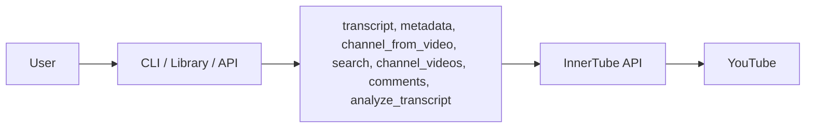

# InnerTube – YouTube Data

Python modules to fetch YouTube transcripts, metadata, search, channel videos, channel-from-video, and comments via the InnerTube API. No official API key or quota limits. Config via `.env`.




## Install

```bash
pip install -r requirements.txt
```

Copy `.env.example` to `.env` and adjust if needed (defaults work out of the box). Note: `httpx` is pinned for innertube compatibility.

## Usage

### As a Library

```python
from src.get_transcript import get_transcript
from src.get_metadata import get_metadata
from src.get_channel_from_video import get_channel_from_video
from src.search import search
from src.get_channel_videos import get_channel_videos
from src.get_comments import get_comments
from src.analyze_transcript import analyze_transcript

# Transcript (returns list of {text, start_ms})
segments = get_transcript("https://www.youtube.com/watch?v=dQw4w9WgXcQ")
for s in segments:
    print(s["text"])

# Metadata (returns dict)
meta = get_metadata("dQw4w9WgXcQ")
print(meta["titulo"], meta["views"], meta["thumbnail_url"])

# Channel from video (returns {canal_id, nome, url_canal})
channel = get_channel_from_video("dQw4w9WgXcQ")
print(channel["canal_id"], channel["nome"])

# Search (returns {items, continuation})
result = search("arctic monkeys", type="video")
for item in result["items"]:
    print(f"[{item['type']}] {item['id']} - {item['title']}")

# Channel videos (returns {items, continuation})
result = get_channel_videos("UCXuqSBlHAE6Xw-yeJA0Tunw")
for item in result["items"]:
    print(f"[{item['video_id']}] {item['title']}")

# Comments (returns {items, continuation})
result = get_comments("dQw4w9WgXcQ", sort="top")
for item in result["items"]:
    print(f"[{item['autor']}] {item['texto']}")

# Analyze transcript with Gemini (returns {text, usage?})
result = analyze_transcript("dQw4w9WgXcQ", "Summarize this video")
print(result["text"])
```

### Command Line

```bash
python -m src.get_transcript dQw4w9WgXcQ
python -m src.get_metadata dQw4w9WgXcQ
python -m src.get_channel_from_video dQw4w9WgXcQ
python -m src.search "arctic monkeys" --type video
python -m src.get_channel_videos UCXuqSBlHAE6Xw-yeJA0Tunw
python -m src.get_comments dQw4w9WgXcQ --sort top
python -m src.analyze_transcript dQw4w9WgXcQ "Summarize this video"
```

## Test 

```bash
python -m src.test_all
```

## API

```bash
python -m uvicorn src.api:app --reload --host 127.0.0.1 --port 8000
```

Server at `http://127.0.0.1:8000`. If port 8000 fails (WinError 10013), try `--port 8080`. Interactive docs at `/docs`.

**Postman:** Import `InnerTchube.postman_collection.json` in Postman to test all endpoints (transcript, metadata, channel-from-video, search, channel-videos, comments, analyze-transcript) with ready-made examples. The collection includes requests with and without pagination (continuation).

curl examples:

```bash
# Transcript
curl "http://127.0.0.1:8000/transcript?url_or_id=dQw4w9WgXcQ"

# Metadata
curl "http://127.0.0.1:8000/metadata?url_or_id=dQw4w9WgXcQ"

# Channel from video
curl "http://127.0.0.1:8000/channel-from-video?url_or_id=dQw4w9WgXcQ"

# Search (video|channel|playlist|film)
curl "http://127.0.0.1:8000/search?q=arctic%20monkeys&type=video"

# Search with continuation
curl "http://127.0.0.1:8000/search?q=arctic%20monkeys&type=video&continuation=TOKEN"

# Channel videos
curl "http://127.0.0.1:8000/channel-videos?channel_id=UCXuqSBlHAE6Xw-yeJA0Tunw"

# Channel videos with continuation
curl "http://127.0.0.1:8000/channel-videos?channel_id=UCXuqSBlHAE6Xw-yeJA0Tunw&continuation=TOKEN"

# Comments (top|newest)
curl "http://127.0.0.1:8000/comments?url_or_id=dQw4w9WgXcQ&sort=top"

# Comments with continuation
curl "http://127.0.0.1:8000/comments?url_or_id=dQw4w9WgXcQ&sort=top&continuation=TOKEN"

# Analyze transcript (Gemini)
curl "http://127.0.0.1:8000/analyze-transcript?url_or_id=dQw4w9WgXcQ&prompt=Summarize%20this%20video"
```

## Config

Parameters (API keys, versions, timeout, GEMINI_API_KEY, GEMINI_MODEL, GEMINI_COST_PER_1M_INPUT, GEMINI_COST_PER_1M_OUTPUT) in `.env`. Copy `.env.example` to `.env`. Set `GEMINI_API_KEY` for `analyze_transcript`. Cost vars are optional (for usage estimation).

Functions accept full URLs or video ID (11 chars): `https://www.youtube.com/watch?v=VIDEO_ID`, `https://youtu.be/VIDEO_ID`, `dQw4w9WgXcQ`.

## Structure

```
innertube/
├── src/
│   ├── get_transcript.py
│   ├── get_metadata.py
│   ├── get_channel_from_video.py
│   ├── get_transcript_lib.py
│   ├── search.py
│   ├── get_channel_videos.py
│   ├── get_comments.py
│   ├── analyze_transcript.py
│   ├── config.py
│   ├── test_all.py
│   └── api.py
├── InnerTchube.postman_collection.json
├── .env.example
├── requirements.txt
└── README.md
```

## Limitations

- **Transcript:** Only videos with captions (manual or auto-generated).
- **Metadata:** Structure may change if YouTube updates InnerTube.
- **Comments:** On some videos `autor` and `texto` may be empty; pagination via `continuation` works.
- **Analyze transcript:** Requires `GEMINI_API_KEY`; uses Gemini API (rate limits apply).

## License

Use at your own risk. This project is not affiliated with YouTube or Google.